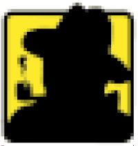

# Maigret

<p align="center">
  
</p>

<i>The Commissioner Jules Maigret is a fictional French police detective, created by Georges Simenon. His investigation method is based on understanding the personality of different people and their interactions.</i>

## About

This is a [sherlock](https://github.com/sherlock-project/) fork with cool features under heavy development.
Don't forget to update source code from repo.

Currently supported [>400 sites](/sites.md), the list grows every day.

## Main features

* Profile pages parsing, [extracting](https://github.com/soxoj/socid_extractor) personal info, links to other profiles, etc.
* Recursive search by new usernames found
* Search by tags (site categories, countries)
* Censorship and captcha detection
* Very few false positives

## Installation

**NOTE**: Python 3.6 or higher and pip is required.

```bash
# clone the repo and change directory
$ git clone https://github.com/soxoj/maigret && cd maigret

# install the requirements
$ python3 -m pip install -r requirements.txt
```

[](https://console.cloud.google.com/cloudshell/open?git_repo=https://github.com/soxoj/maigret&tutorial=README.md)

## Demo with page parsing and recursive username search

[](https://asciinema.org/a/348196)

Listing:
```bash
$ python3 maigret --ids --print-found --skip-errors alexaimephotographycars
[*] Checking username alexaimephotographycars on:
[+] 500px: https://500px.com/alexaimephotographycars
 ┣╸uid: 26403415
 ┣╸username: alexaimephotographycars
 ┣╸name: Alex Aimé
 ┣╸website: www.flickr.com/photos/alexaimephotography/
 ┣╸facebook_page:  www.instagram.com/street.reality.photography/
 ┣╸instagram_username: alexaimephotography
 ┗╸twitter_username: Alexaimephotogr
[*] Checking username alexaimephotography on:
[+] DeviantART: https://alexaimephotography.deviantart.com
 ┣╸country: France
 ┣╸registered_for_seconds: 50826061
 ┣╸gender: male
 ┣╸username: Alexaimephotography
 ┣╸twitter_username: alexaimephotogr
 ┣╸website: www.instagram.com/alexaimephotography/
 ┗╸links:
   ┗╸ https://www.instagram.com/alexaimephotography/
[+] EyeEm: https://www.eyeem.com/u/alexaimephotography
[+] Facebook: https://www.facebook.com/alexaimephotography
[+] Instagram: https://www.instagram.com/alexaimephotography
 ┣╸uid: 6828488620
 ┗╸username: alexaimephotography
[+] Pinterest: https://www.pinterest.com/alexaimephotography/
[+] Reddit: https://www.reddit.com/user/alexaimephotography
[+] VK: https://vk.com/alexaimephotography
[+] Vimeo: https://vimeo.com/alexaimephotography
 ┣╸uid: 75857717
 ┣╸name: AlexAimePhotography
 ┣╸username: alexaimephotography
 ┣╸location: France
 ┣╸created_at: 2017-12-06 06:49:28
 ┣╸is_staff: False
 ┗╸links:
   ┣╸ https://500px.com/alexaimephotography
   ┣╸ https://www.flickr.com/photos/photoambiance/
   ┣╸ https://www.instagram.com/alexaimephotography/
   ┣╸ https://www.youtube.com/channel/UC4NiYV3Yqih2WHcwKg4uPuQ
   ┗╸ https://flii.by/alexaimephotography/
[+] We Heart It: https://weheartit.com/alexaimephotography
[*] Checking username Alexaimephotogr on:
[+] Twitter: https://twitter.com/Alexaimephotogr
```

## License

MIT © Maigret<br/>
MIT © [Sherlock Project](https://github.com/sherlock-project/)<br/>
Original Creator of Sherlock Project - [Siddharth Dushantha](https://github.com/sdushantha)
