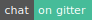
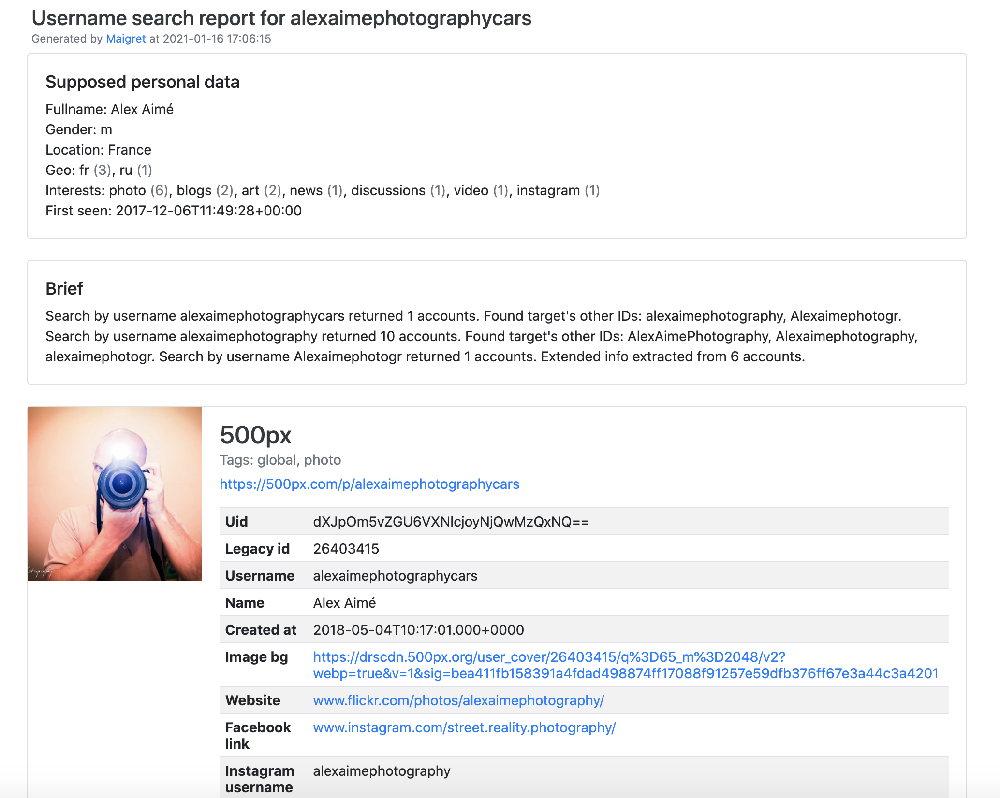
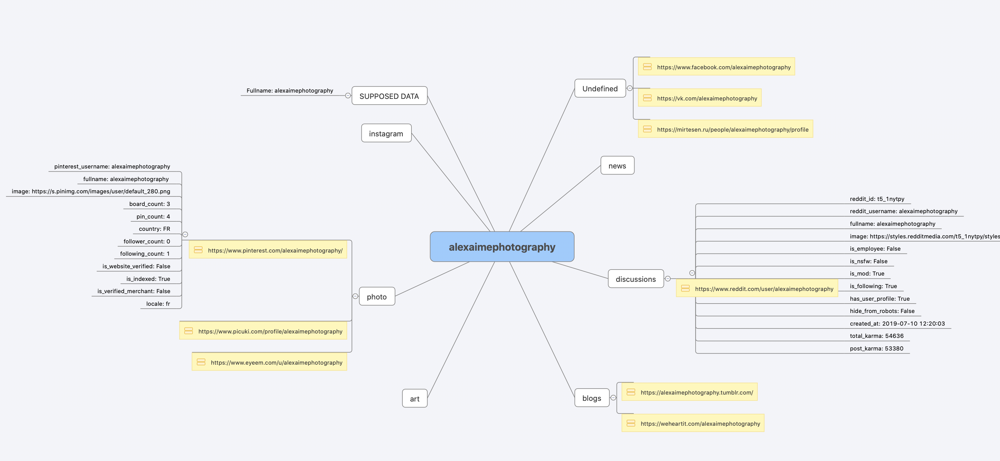

# Maigret


[](https://gitter.im/maigret-osint/community)

<p align="center">
  
</p>

<i>The Commissioner Jules Maigret is a fictional French police detective, created by Georges Simenon. His investigation method is based on understanding the personality of different people and their interactions.</i>

## About

Purpose of Maigret - **collect a dossier on a person by username only**, checking for accounts on a huge number of sites.

This is a [sherlock](https://github.com/sherlock-project/) fork with cool features under heavy development.
*Don't forget to regularly update source code from repo*.

Currently supported more than 2000 sites ([full list](./sites.md)), by default search is launched against 500 popular sites in descending order of popularity.

## Main features

* Profile pages parsing, [extracting](https://github.com/soxoj/socid_extractor) personal info, links to other profiles, etc.
* Recursive search by new usernames found
* Search by tags (site categories, countries)
* Censorship and captcha detection
* Very few false positives

## Installation

**NOTE**: Python 3.6 or higher and pip is required.

**Python 3.8 is recommended.**

### Package installing
```bash
# install from pypi
pip3 install maigret

# or clone and install manually
git clone https://github.com/soxoj/maigret && cd maigret
pip3 install .
```

### Cloning a repository

```bash
git clone https://github.com/soxoj/maigret && cd maigret
```

You can use your a free virtual machine, the repo will be automatically cloned:

[](https://console.cloud.google.com/cloudshell/open?git_repo=https://github.com/soxoj/maigret&tutorial=README.md) [](https://repl.it/github/soxoj/maigret)
<a href="https://colab.research.google.com/gist//soxoj/879b51bc3b2f8b695abb054090645000/maigret.ipynb"></a>

```bash
pip3 install -r requirements.txt
```

## Using examples

```bash
# for a cloned repo
./maigret.py user

# for a package
maigret user
```

Features:
```bash
# make HTML and PDF reports
maigret user --html --pdf

# search on sites marked with tags photo & dating
maigret user --tags photo,dating


# search for three usernames on all available sites
maigret user1 user2 user3 -a

```

Run `maigret --help` to get arguments description. Also options are documented in [the Maigret Wiki](https://github.com/soxoj/maigret/wiki/Command-line-options).

With Docker:
```
# manual build
docker build -t maigret . && docker run maigret user

# official image
docker run soxoj/maigret:latest user
```

## Demo with page parsing and recursive username search

[PDF report](./static/report_alexaimephotographycars.pdf), [HTML report](https://htmlpreview.github.io/?https://raw.githubusercontent.com/soxoj/maigret/main/static/report_alexaimephotographycars.html)







[Full console output](./static/recursive_search.md)

## License

MIT © [Maigret](https://github.com/soxoj/maigret)<br/>
MIT © [Sherlock Project](https://github.com/sherlock-project/)<br/>
Original Creator of Sherlock Project - [Siddharth Dushantha](https://github.com/sdushantha)
