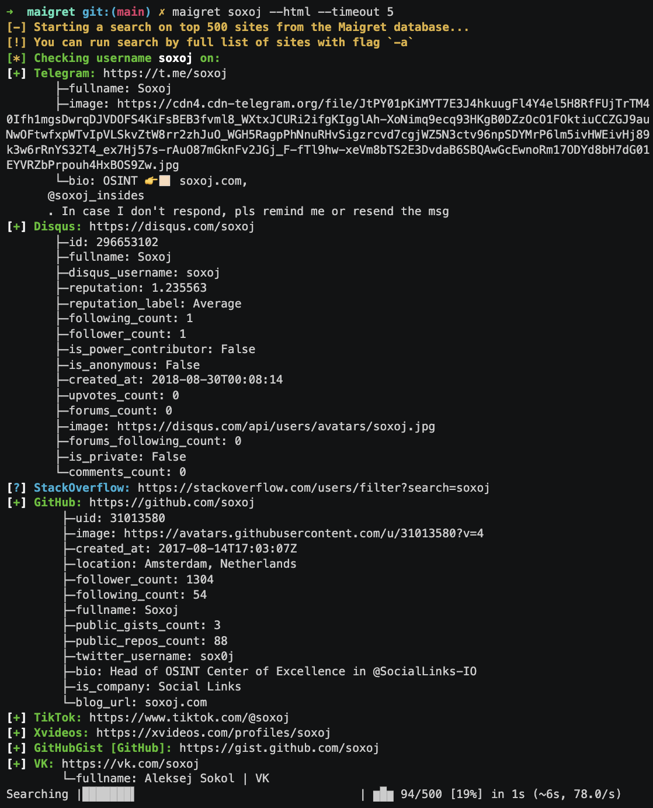

.. _quick-start:

Quick start
===========

After :doc:`installing Maigret <installation>`, you can begin searching by providing one or more usernames to look up:

``maigret username1 username2 ...``

Maigret will search for accounts with the specified usernames across a vast number of websites. It will provide you with a list 
of URLs to any discovered accounts, along with relevant information extracted from those profiles.

